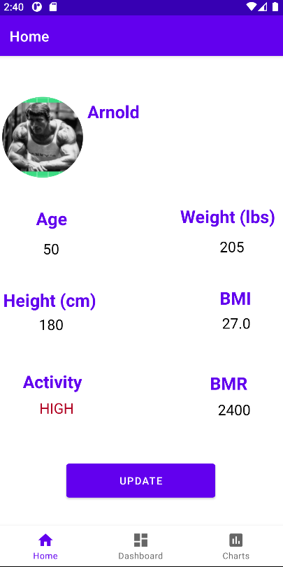
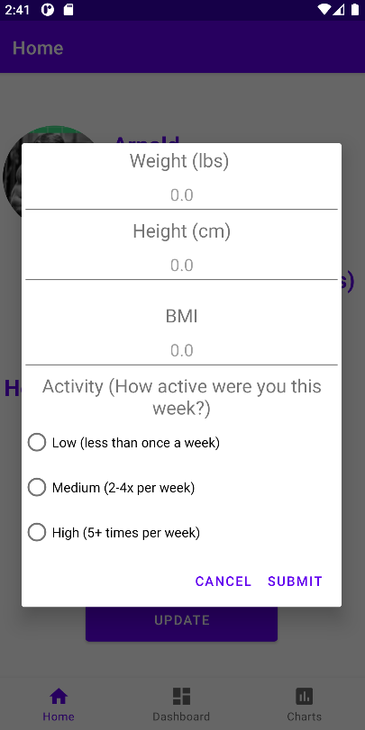
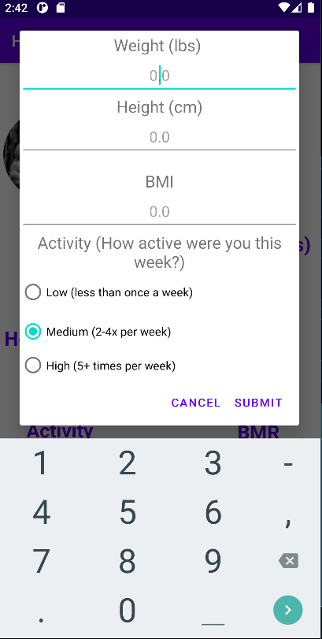
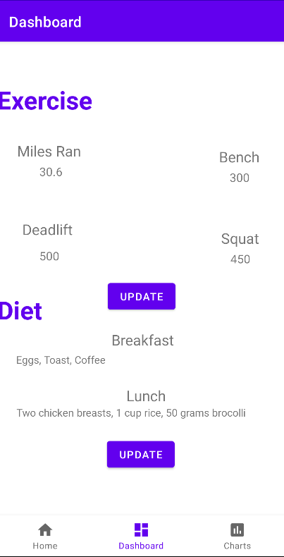
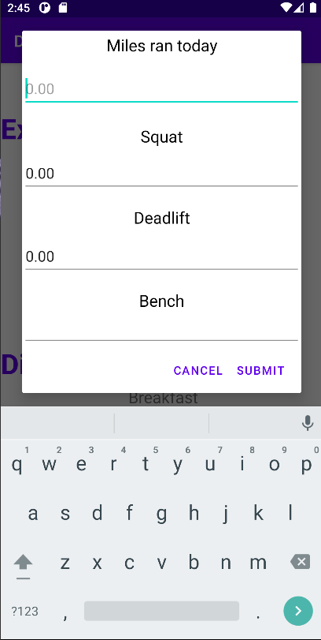
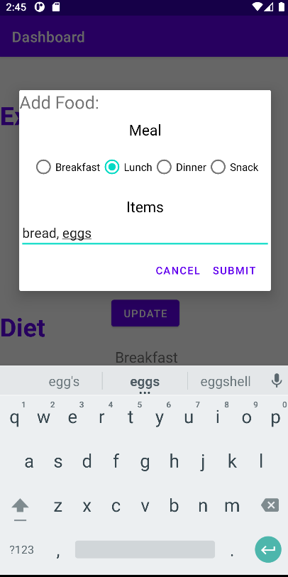
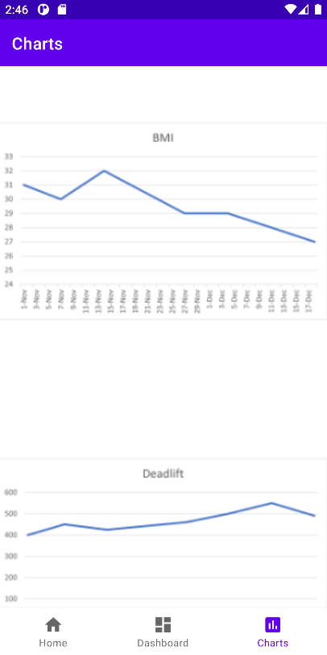

# FitnessApp (Medium Fidelity Prototype)

## Overview
### What is a medium fidelity prototype?
This is a medium fidelity prototype of a fitness tracking application. A medium fidelity prototype of an application has a fully completed layout of the navigation and screens as well as the theme of the app including typography, colors, and icons. The major features of the application are finished however other less important features are not ready. This type of prototype is used to give the basic feel of using the application so that developers can gather input from test users before moving forward with the rest of the applicatiopn. 
### Goal
The final fitness application will allow users to track their daily dietary and gym data. The application uses different user provided metrics to calculate helpful information such as visual representations of their progress in the gym or their BMI, and BMR. The application was developed in Android studio using Kotlin. 

## Prototype walk through
### Data storage
The app uses the firebase realtime database for storing and retrieving data created by users. 

### Home page
The home page of the application displays useful biometric data such as the their weight, their basal metabolic rate, BMI. The user can update their biometric data by presing the update button. 

#### Update Home
A dialog appears over the screen with a form where the user can input their updates. The keyboard appears and does not obstruct the users view of the form.

### Dashboard
The dashboard shows the user's exercise and diet data. Their personal records at the gym and the day's diet can be recorded here.

#### Update Dashboard
The user updates their dashbord data by inputing the new information in these forms.

### Charts
This displays the various data from the home page and dashboard over time. Users can use these charts to get a better idea of their progress and what steps they should take or change in order to reach their personal fitness goals.

